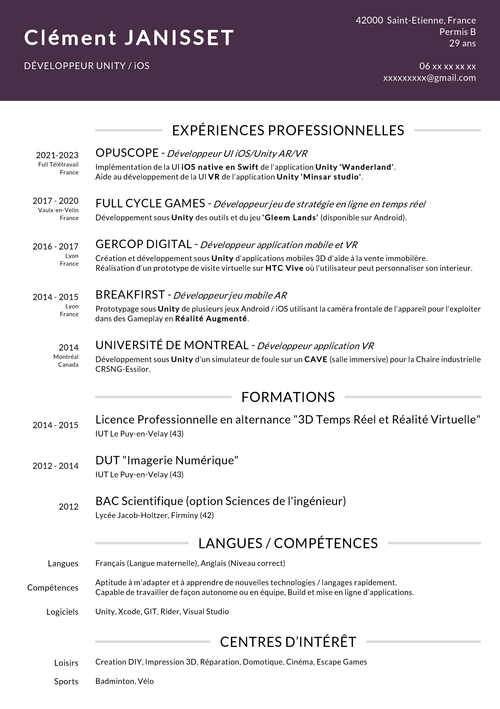

# Unity CV Generator

Generate a CV inside Unity Editor with:
- Customizable design & code.
- Saving & Loading your CV data to JSON file (Useful to edit your CV later)

## Installation & Usage

- Clone the repo and open the project. 
- Open the CV Editor located inside the CV Generator tab.
- Load a design prefab inside "CV Displayer Prefab" field (a default design can be found inside the Designs folder), and click on the "Update Displayer" button.
- You can now edit your data or load an exemple located inside the Generated folder.
- When you are ready, click on the "Export to PNG" button and voila.

Note: Don't forget to save your data by using the "Save data" button. This way, you'll be able to load & edit it later.

Note 2: The Editor UI refresh is triggered by the mouse leaving/entering a window. So if your CV layout looks off, you can click on the "Refresh layout" button.

## Exemple of generated CV

